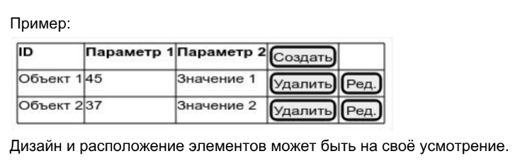
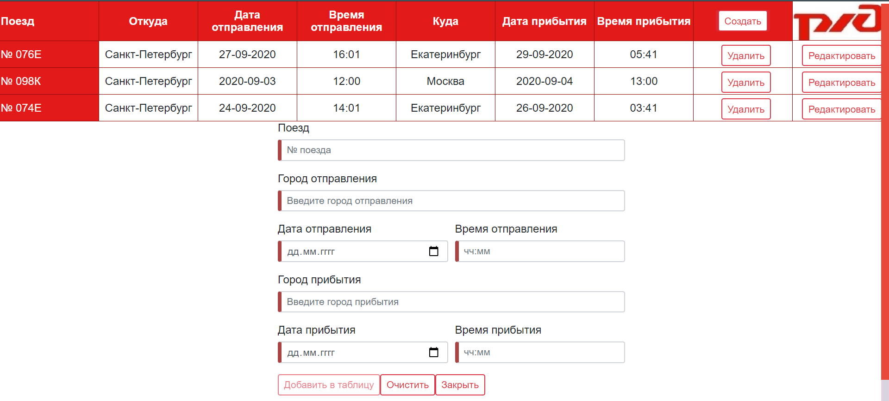

Тестовое задание Angular
========================
Задача:
1. Выбрать предметную область.
2. Создать Angular-приложение, в котором есть возможность: 
 
 * просмотра данных (в табличном виде);
 * добавления новых данных;
 * редактирования данных;
 * удаления данных;
 * использование не менее 3-х пользовательских компонентов.

При запуске приложения таблица должна быть инициализирована данными.
Необязательные требования:
 * Сохранение данных в localStorage
 * Использование роутера Angular
 

Результат работы:

